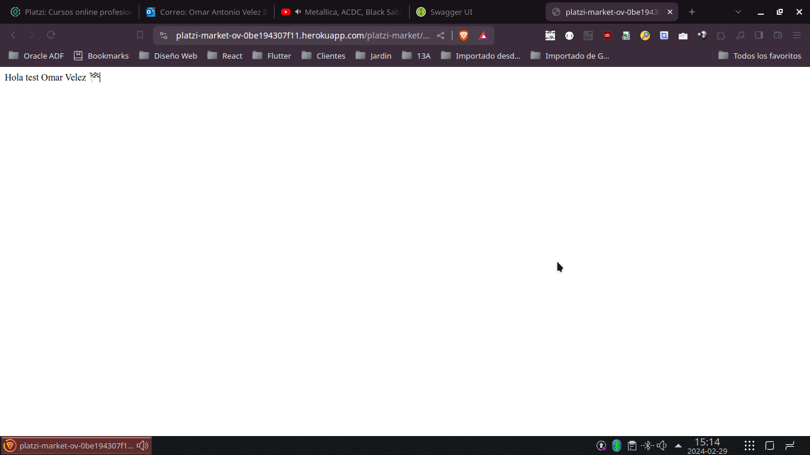
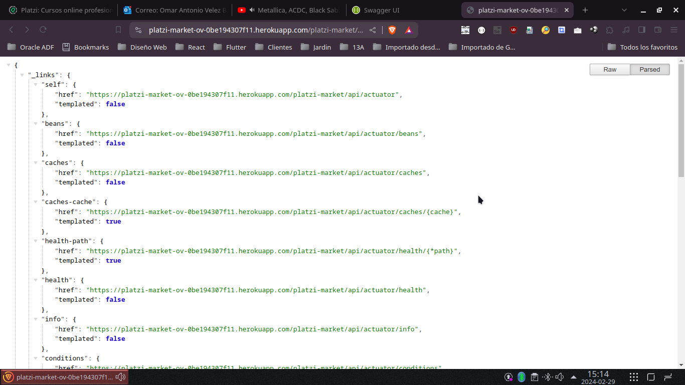
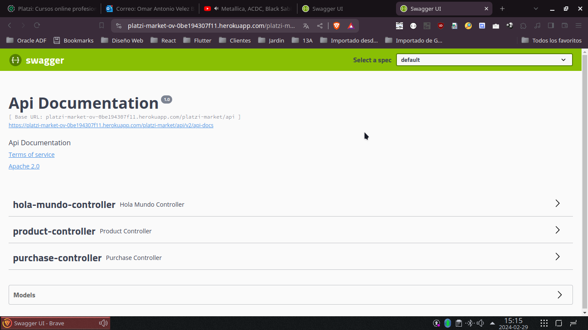

# Platzi 2024 - Jardin Azuayo

## Curso de Java Spring
Este es proyecto de Java Spring para terminar el curso.

## Novedades del desarrollo
Ya que en mi trabajo se utiliza Maven como gestor de dependencias, he decidido utilizarlo en este proyecto.

De igual manera, se ha utlizado la libreriía de Lombok para reducir la cantidad de código que se escribe.

Y por último, se ha utilizado actuator para monitorear el estado de la aplicación.

Y todo esta implementado en el archivo de configuración de Maven.  [ver pom.xml](pom.xml)

## Heroku 
Se ha desplegado la aplicación en Heroku, para que puedas verla en acción. [Ver aplicación](https://platzi-market-ov-0be194307f11.herokuapp.com/platzi-market/api/swagger-ui.html)

Aun que si el proyecto no esta corriendo se deja la evidencia grafica a continuación:

Saludar
Url: https://platzi-market-ov-0be194307f11.herokuapp.com/platzi-market/api/saludar/

Actuator
Url: https://platzi-market-ov-0be194307f11.herokuapp.com/platzi-market/api/actuator

Swagger
Url: https://platzi-market-ov-0be194307f11.herokuapp.com/platzi-market/api/swagger-ui.html

## Demo de uso
Para poder utilizar la aplicación se hizo desde el swagger y el mismo presenta el siguiente video:

## Heroku
Se ha desplegado la aplicación en Heroku, se dejan adjuntos los archivos PDF de la configuracion del app y de la base de datos en los siguientes enlaces:

[Configuración de la aplicación](./imagenes/platzi-market-ovHeroku.pdf)

[Configuración de la base de datos](./imagenes/postgresql-opaque-29209HerokuData.pdf)

---

<o.velez@jardinazuayo.fin.ec>

**Actualizado: 2024-02-29**
